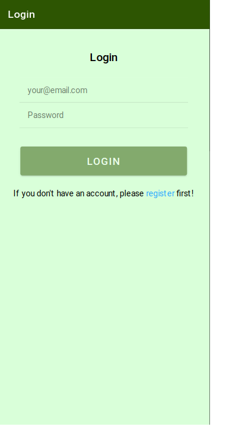
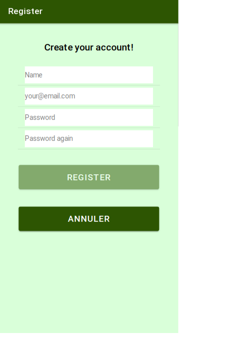
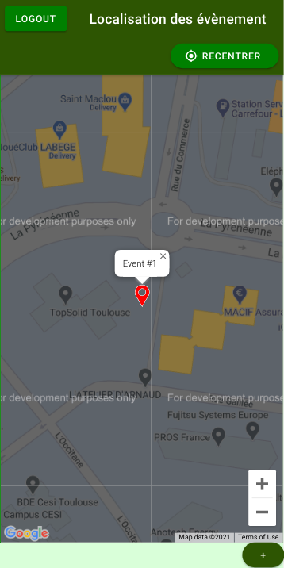
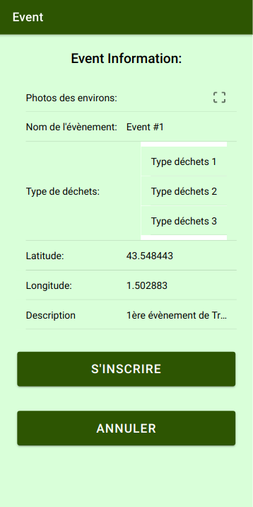

# TrashYvent

This project is a mock Ionic app to create and participate to ecological event.

## Motivation

This application was developed as part of a school project for innovation and business courses.
The idea was to deploy an application that would encourage people to keep their environment clean with the possibility of organizing a clean-up event and give participants a reward when the event was over (whether it was a discount at a restaurant or a store with a partnership in the area).

## Screenshots
### Login

### Register

### Homepage

### Event description

When clicking on a marker on the map in homepage, we get this page:

### Event form

When clicking on the (+) button at the bottom of the homepage we get this form:

## Tech/Framework used

Ionic:
- Angular:
  - Typescript
  - Html
  - SCSS

Google Map API

## How to use

For now this app is not a finished product and can't work fully. 
If you want to test it, you'll have to clone this project wherever you want it to be.
Change the API keys for Google map in the config.xml (click [here](https://developers.google.com/maps/documentation/maps-static/get-api-key) to learn how to get a Google map API key).
The run the project with the command `ionic cordova run browser`
Your browser should open a new tab with the app runing else go to `http://localhost:8000/`

## Credits

Thanks to [Maxime DUFFAUT](https://github.com/DuffautM/) and [Anthony LUQUES](https://github.com/AnthonyLuqueCESI) which contributed to this project.
